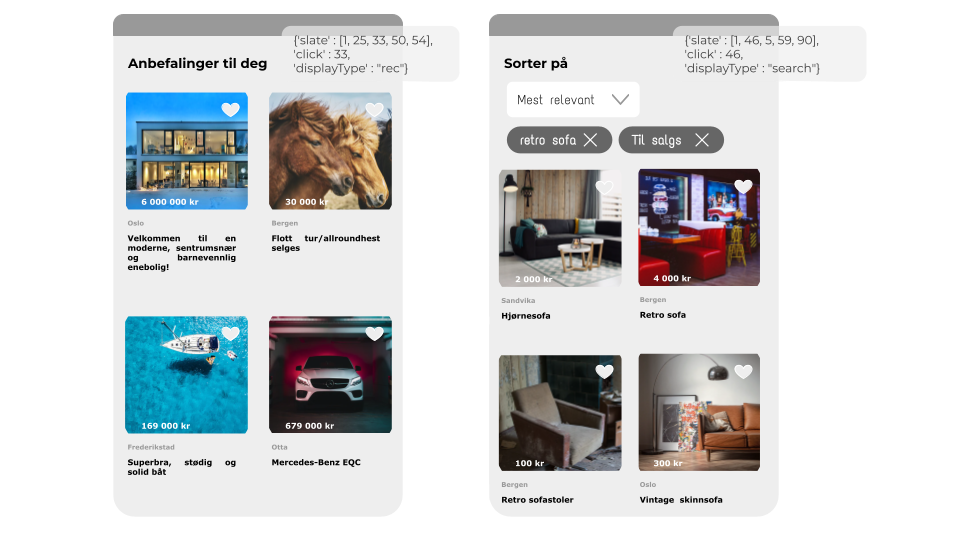

# FINN.no Recommender Systems Slate Dataset
This repository accompany the paper ["Dynamic Slate Recommendation with Gated Recurrent Units and Thompson Sampling"](https://arxiv.org/abs/2104.15046) by Simen Eide, David S. Leslie and Arnoldo Frigessi.
The article is under review, and the pre-print can be obtained [here](https://arxiv.org/abs/2104.15046).

The repository is split into the dataset (`data/`) and the accompanying code for the paper (`code/`).

We release the *FINN.no recommender systems slate dataset* to improve recommender systems research.
The dataset includes both search and recommendation interactions between users and the platform over a 30 day period.
The dataset has logged both exposures and clicks, *including interactions where the user did not click on any of the items in the slate*.



For each user u and interaction step t we recorded all items in the visible slate  ) (up to the scroll length ), and the user's click response .
The dataset consists of 37.4 million interactions, |U| ≈ 2.3) million  users and |I| ≈ 1.3 million items that belong to one of G = 290 item groups. For a detailed description of the data please see the [paper](https://arxiv.org/abs/2104.15046).


FINN.no is the leading marketplace in the Norwegian classifieds market and provides users with a platform to buy and sell general merchandise, cars, real estate, as well as house rentals and job offerings.

This repository is currently *work in progress*, and we will provide descriptions and tutorials. Suggestions and contributions to make the material more available is welcome.

For questions, email simen.eide@finn.no or file an issue.

## Download and prepare dataset

The data file is compressed, unzip by the following command: `gunzip -c data.pt.gz >data.pt`

1. Install git-lfs: This repository uses `git-lfs` to store the dataset. Therefore you need the git-lfs package in addition to github. See [https://git-lfs.github.com/] for installation instructions.
(e.g. for apt-get `sudo apt-get install git-lfs`)
2. Clone the repository
3. The data file is compressed, unzip by the following command: `gunzip -c data.pt.gz >data.pt`

## Quickstart dataset [](https://colab.research.google.com/github/finn-no/recsys-slates-dataset/blob/master/quickstart-finn-recsys-slate-data.ipynb)
We provide a quickstart jupyter notebook that runs on Google Colab (quickstart-finn-recsys-slate-data.ipynb) which includes all necessary steps above.


## Citations
If you use either the code, data or paper, please consider citing the paper.

```
@article{eide2021dynamic,
      title={Dynamic Slate Recommendation with Gated Recurrent Units and Thompson Sampling}, 
      author={Simen Eide and David S. Leslie and Arnoldo Frigessi},
      year={2021},
      eprint={2104.15046},
      archivePrefix={arXiv},
      primaryClass={stat.ML}
}
```

# Todo
There are some limitations on the repository today that we would like to improve:

- Release the dataset as numpy objects instead of pytorch arrays. This will help non-pytorch users to more easily utilize the data
- Create a pip package for easier installation and usage
- Add easily useable functions that compute relevant metrics such as hitrate, log-likelihood etc.
- Distribute the data on other platforms such as kaggle

As the current state is in early stage, it makes sense to allow the above changes non-backward compatible. 
However, this should be completed within the next couple of months.
